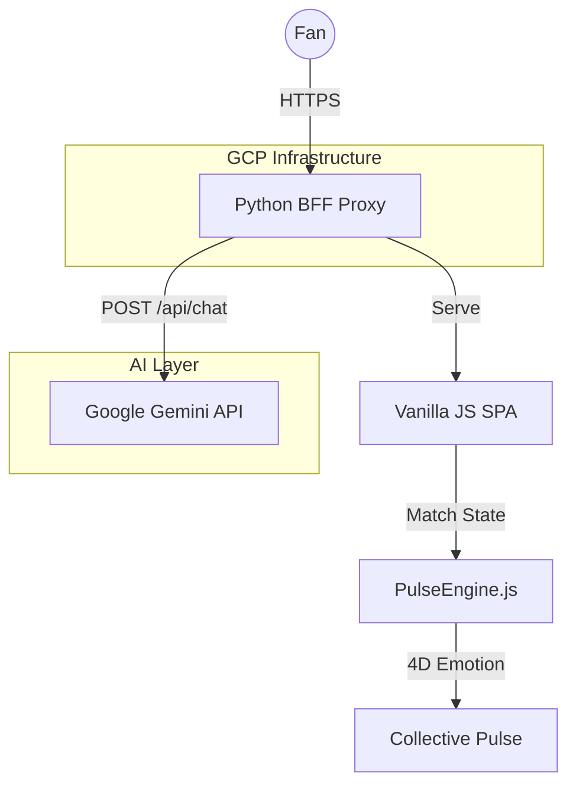

# 🏏 PulsePresence

**A cinematic, AI-native second-screen experience for live cricket. Don't just watch the match — be inside it.**

[](https://pulsepresence-xgg73naweq-el.a.run.app)
[](https://github.com/Eternalnik001/PulsePresence)

> *Built for the Google Cloud "Agentic Premier League" — 1st Innings Challenge*

---

## 🎯 The Philosophy: Presence > Gamification

Most second-screen apps fail because they treat cricket like a video game (XP, points, leaderboards). **PulsePresence** treats cricket like a *shared emotional history*.

We replace "predict the next ball" with **"make the call as Co-Captain"**. We replace "generic emoji chat" with a **"synchronized Stadium Wave"**. We replace "standard commentary" with a **"Personalized AI Match Director"**.

---

## 🎨 The Four Pillars

### 1. 🎬 AI Match Director
Powered by **Google Gemini 1.5/2.0**. The Director tracks your chosen team, the current match "chapter" (Powerplay, Death Overs, etc.), and the global emotional pulse. It whispers 1-2 sentence narrative beats directly to you, providing an intimate, cinematic layer to the broadcast.

### 2. ▲ Co-Captain Mode
Tactical participation, not gambling. Between overs, choose field settings or bowling changes. See what the crowd picked and compare it to the real-world captain's decision as it unfolds.

### 3. 🌊 Stadium Wave
Synchronized real-time participation. When viewers hold the orb together, a **coordinated haptic and visual ripple** fires across all connected devices globally. It’s the digital equivalent of being in the stands.

### 4. ✦ Key Moment Theatre
Automatic cinematic transformation. When a wicket falls or a six is hit, the UI auto-transforms into a full-screen "Theatre" with AI-generated context, collective sentiment bars, and visceral reactions.

---

## 🏗️ Technical Architecture (Senior Dev View)

PulsePresence is designed for high-concurrency "Flash Events" common in live sports.



### Stack & Security
- **Frontend**: Vanilla JS (ES6+), CSS Grid/Flex, zero-dependency SPA.
- **Backend**: Python 3.11 BFF (Backend-for-Frontend) on **Google Cloud Run**.
- **AI**: Google Gemini Pro/Flash via the `generativelanguage` API.
- **Security**: Zero client-side API keys. Authentication and rate-limiting are handled by the Python BFF.
- **Deployment**: Fully containerized via Docker and deployed to `asia-south1`.

---

## 🚀 Quick Start

### Local Development
1. Clone the repo:
   ```bash
   git clone https://github.com/Eternalnik001/PulsePresence.git
   cd PulsePresence
   ```
2. Set up your environment:
   ```bash
   echo "GEMINI_API_KEY=your_key_here" > .env
   ```
3. Run the proxy:
   ```bash
   python3 proxy.py
   # Open http://localhost:8080
   ```

### GCP Deployment
We use a streamlined deployment script for Cloud Run:
```bash
./deploy.sh
```
*Requires `gcloud` CLI configured.*

---

## 📂 Project Structure

```
pulsepresence/
├── proxy.py              ← Python BFF & Static Server (Cloud Run entry)
├── Dockerfile            ← Container config
├── deploy.sh             ← Automated GCP deployment
├── js/
│   ├── config.js         ← Endpoint & feature flags
│   ├── director.js       ← AI Narrator (Gemini Integration)
│   ├── engine.js         ← Match Loop & 4D Emotion Model
│   ├── wave.js           ← Real-time Orb Mechanic
│   └── ...               ← Modular Pillars
├── data/
│   └── match.json        ← Cricsheet-format match data
└── README.md
```

---

## 🛠️ Roadmap
- **Live WebSocket Sync**: Moving from simulation to real-time Opta/Sportradar feeds.
- **Vertex AI Integration**: Utilizing Vertex for managed AI pipelines and fine-tuned narrative models.
- **Multi-Viewer "Suites"**: Private emotional synchronization for friend groups.

---

*Don't watch the match. Be inside it.*

**PulsePresence** | 2024
